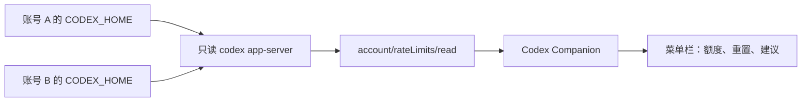

# Codex Companion

一个专注于 **Codex 5 小时额度、周额度、重置时间和多账号建议** 的 macOS 菜单栏应用。


## 它解决什么问题

应用启动后会在顶部菜单栏显示 `◈ xx%`；点击它会打开紧凑的状态栏浮层：

- 实际 5 小时（或当前短周期）额度剩余比例与倒计时；
- 实际周额度（或当前长周期）剩余比例与倒计时；
- 按 `70% 短周期 + 30% 长周期` 计算的账号建议；
- 读取时间与陈旧数据提示。

状态栏浮层采用赛博朋克控制台视觉：深色网格、霓虹进度条和高亮账号路由区，便于一眼判断当前可用额度。

额度来自本机 Codex CLI 的只读 `app-server` 协议，而不是通过任务数或 Token 推算。窗口时长、百分比和重置时间由 Codex 返回，因此不会把产品规则写死为固定数值。

## 隐私边界

- 不读取、复制、导出或保存密码、Cookie、聊天内容和 Access Token。
- 不调用网页私有接口，不操作账号，不消耗或重置额度。
- 每个 Profile 仅以其现有 `CODEX_HOME` 运行只读 `codex app-server`；Codex CLI 自行处理认证。
- 应用只在 `~/Library/Application Support/CodexCompanion/` 保存账号别名和已脱敏的额度快照。

详见 [隐私说明](docs/PRIVACY.md)。

## 安装与运行

要求：macOS 14+、已安装并登录 Codex CLI、Swift 6（仅从源码构建时需要）。

```bash
git clone https://github.com/YX-NAS/codex-companion.git
cd codex-companion
./scripts/install_local.sh
```

脚本会构建 `Codex Companion.app`、进行本机临时签名、安装至 `~/Applications/` 并启动。首次启动后，菜单栏会显示 `C 98%` 一类的短周期剩余比例；读取失败时显示 `C ?`，点击菜单即可看到原因。

### 多账号配置

菜单栏点击 **打开配置文件**。默认配置只含“当前 Codex 账号”：

```json
{
  "accounts": [
    { "id": "us", "displayName": "US Plus", "isEnabled": true },
    {
      "id": "tr",
      "displayName": "TR Plus",
      "codexHome": "~/.codex-tr",
      "isEnabled": true
    }
  ],
  "refreshIntervalSeconds": 300,
  "schemaVersion": 1,
  "staleAfterSeconds": 900
}
```

每个 `codexHome` 必须是你自己已通过 Codex 登录过的目录，并包含该 Profile 的认证配置。应用不会创建、复制或修改此目录。

在状态栏浮层底部点击 **刷新额度** 会重新读取所有账号；点击 **账号设置** 可直接打开上述配置文件。保存配置后再点击 **刷新额度**，无需重启应用。

## 工作方式



调用顺序是 `initialize` → `account/rateLimits/read`。应用只读取 `usedPercent`、`windowDurationMins`、`resetsAt`、计划类型和限额状态。运行查询时使用 `read-only` sandbox 与 `untrusted` 审批模式。

## 开发

```bash
swift run CodexCompanionTestRunner
swift build
./scripts/package_app.sh
open "dist/CodexCompanion.app"
```

更多内容：

- [完整设计](docs/CODEX_COMPANION_DESIGN.md)
- [开发计划](docs/CODEX_COMPANION_DEVELOPMENT_PLAN.md)
- [开源项目调研与审核](docs/RESEARCH_AND_REVIEW.md)
- [测试计划](docs/TEST_PLAN.md)
- [使用手册](docs/USER_GUIDE.md)
- [发布说明](docs/RELEASE.md)

## 已知限制

- 每个账号必须已有独立的本地 Codex Profile；应用不会为你登录、切换账号或同步浏览器会话。
- Codex CLI 或其 app-server 协议升级后，字段可能变化；解析失败时应用保留旧快照并清楚标记读取失败。
- 数据超过默认 15 分钟未刷新时不会用于账号建议。
- 本项目不隶属于 OpenAI。以 Codex 使用量页面和 Codex 客户端显示的结果为准。

## 许可证

MIT。见 [LICENSE](LICENSE)。
