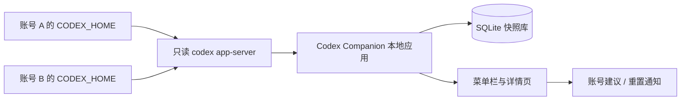

# Codex Companion 设计方案

> 版本：v0.1（MVP）
> 日期：2026-07-10
> 目标平台：macOS 14+

## 1. 结论

Codex Companion 是一个本地运行的 macOS 菜单栏工具。它解决一个明确问题：**现在该用哪个 Codex 账号继续开发，何时恢复可用额度。**

MVP 只显示四类决策信息：

1. 每个账号的短周期额度（界面当前展示的 5 小时窗口或等效窗口）。
2. 每个账号的长周期额度（界面当前展示的周窗口或等效窗口）。
3. 每个窗口的重置倒计时与绝对重置时间。
4. 基于以上数据给出的账号建议及理由。

不统计普通 ChatGPT 聊天条数，不从 Codex CLI 日志估算剩余额度，不自动切换或登录账号。

## 2. 产品边界

### 2.1 要做

- 支持两个及以上用户手动配置的账号别名。
- 通过用户已登录的本机 Codex CLI，以只读 app-server 协议读取结构化额度、重置时间和更新时间。
- 本地保存快照并在菜单栏即时展示最新状态。
- 计算推荐账号、显示数据新鲜度，并提供刷新、历史与通知。
- 所有业务数据仅保存在本机。

### 2.2 不做

- 不读取 Cookie、访问令牌、密码或聊天内容。
- 不模拟登录，不绕过或规避用量限制，也不调用网页私有接口。
- 不把任务次数、Token 或运行时长换算成“剩余额度”。
- 不承诺固定为“5 小时 + 周”规则；窗口名称、数量和重置格式以官方页面当次展示为准。
- 不做多设备同步、自动账号切换、Claude/Cursor 等多 Provider 支持。

## 3. 事实与设计原则

Codex 的实际消耗会随任务大小、代码库上下文、运行时长和执行位置变化；套餐内额度也可能与其他 Agent 功能共享。因此，产品的额度真相来源必须是 Codex 本机 app-server 返回的结构化限额数据，而不是本地推算。

设计原则：

- **Codex 结构化快照优先**：百分比、窗口分钟数和重置时间原样保留。
- **配置化而非写死**：`短周期`、`长周期`只是 UI 角色；实际标签可为“5 小时”“Weekly”或未来的其他文本。
- **决策优先**：菜单栏在一屏内回答“能否继续用、等多久、用哪个”。
- **本地最小权限**：扩展只允许访问 Codex/ChatGPT 相关页面和 Native Messaging。
- **不确定性显式化**：超过 15 分钟未同步即展示“数据可能已过期”，而非继续作为实时余额。

## 4. 使用流程



首次使用：

1. 在配置文件创建“账号 A”“账号 B”等本地别名。
2. 对每个账号配置一个已经登录过的 `CODEX_HOME`（默认账号无需配置）。
3. 主程序对每个 Profile 启动只读 `codex app-server`，依次请求 `initialize` 和 `account/rateLimits/read`。
4. 菜单栏显示用量、重置时间、建议账号和同步时间。

绑定以用户显式配置的 Codex Profile 为单位，不读取认证文件内容或尝试从日志推断账号身份。

## 5. 信息架构与交互

### 5.1 菜单栏

图标显示当前推荐账号的短周期可用比例，例如 `C 68%`。若数据过期则显示 `C ?`。

点击菜单：

```text
Codex Companion                         已同步 2 分钟前

US Plus
短周期    可用 42%     还剩 3小时12分
长周期    可用 73%     重置 周一 08:00

TR Plus
短周期    可用 81%     还剩 3小时45分
长周期    可用 91%     重置 周一 08:20

建议使用：TR Plus
原因：短周期多 39%，长周期多 18%

刷新当前页面数据
打开 Usage Dashboard
查看详情…
设置…
```

### 5.2 详情页

- 账号卡片：短周期、长周期、重置倒计时、最后同步时间与来源。
- 历史：最近 30 天快照走势；缺失数据不插值。
- 状态：同步成功、页面结构无法识别、账号未绑定、数据已过期。
- 设置：账号别名、权重、过期阈值、通知阈值、数据保留期。

### 5.3 通知

- 推荐账号变更（仅当新推荐账号评分高出至少 15 分）。
- 当前使用账号短周期可用额度低于 20%。
- 短周期或长周期距离重置 10 分钟。
- 重置时间到达后提示“请打开 Usage Dashboard 刷新确认”。

最后一条不宣称已恢复，避免本地定时器与官方实际状态不一致。

## 6. 数据同步

### 6.1 推荐实现

主程序采用 Swift/AppKit；它为每个账号的 `CODEX_HOME` 启动本地 `codex -s read-only -a untrusted app-server`，并通过 stdin/stdout 使用 JSON-RPC 通信。

这种方式避免浏览器扩展、Cookie、网页 DOM 解析和本地 HTTP 端口。Codex CLI 仍在自己的进程中负责认证。

### 6.2 快照协议

```json
{
  "schemaVersion": 1,
  "accountId": "acc_us",
  "capturedAt": "2026-07-10T10:20:00+08:00",
  "source": "codex_app_server",
  "windows": [
    {
      "key": "short",
      "label": "300 minutes",
      "remainingPercent": 42,
      "resetAt": "2026-07-10T14:32:00+08:00",
      "rawText": "42% remaining · resets 14:32"
    },
    {
      "key": "long",
      "label": "Weekly",
      "remainingPercent": 73,
      "resetAt": "2026-07-14T08:00:00+08:00",
      "rawText": "73% remaining · resets Monday"
    }
  ]
}
```

窗口从 `usedPercent`、`windowDurationMins` 和 `resetsAt` 映射；不保存原始 RPC 行、认证信息、提示词或聊天内容。

### 6.3 解析与失败处理

- 只接受 `account/rateLimits/read` 的结构化 `rateLimits` 响应。
- 以 `windowDurationMins` 展示窗口名称：300 分钟显示 5 小时，10080 分钟显示周额度；未知时显示原始分钟数。
- 解析失败不覆盖上一条成功快照；只在内存中显示经过脱敏的错误原因。
- 单次查询 12 秒超时；超时即终止 app-server 子进程，防止菜单栏刷新卡住。

## 7. 本地数据模型

```sql
CREATE TABLE accounts (
  id TEXT PRIMARY KEY,
  display_name TEXT NOT NULL,
  color_hex TEXT,
  is_enabled INTEGER NOT NULL DEFAULT 1,
  created_at TEXT NOT NULL,
  updated_at TEXT NOT NULL
);

CREATE TABLE quota_snapshots (
  id TEXT PRIMARY KEY,
  account_id TEXT NOT NULL REFERENCES accounts(id),
  source TEXT NOT NULL,
  captured_at TEXT NOT NULL,
  parser_version TEXT NOT NULL,
  payload_json TEXT NOT NULL
);

CREATE TABLE quota_windows (
  id TEXT PRIMARY KEY,
  snapshot_id TEXT NOT NULL REFERENCES quota_snapshots(id),
  window_key TEXT NOT NULL,
  label TEXT NOT NULL,
  remaining_percent REAL,
  reset_at TEXT,
  raw_text TEXT
);

CREATE TABLE notification_state (
  id TEXT PRIMARY KEY,
  account_id TEXT NOT NULL REFERENCES accounts(id),
  notification_type TEXT NOT NULL,
  state_key TEXT NOT NULL,
  notified_at TEXT NOT NULL,
  UNIQUE(account_id, notification_type, state_key)
);
```

默认保留 90 天。导出为 JSON；“清除全部数据”必须二次确认。

## 8. 账号建议算法

每次仅使用每个账号的**最新有效快照**。有效条件：短周期与长周期均可识别，且同步时间未超过设置的 15 分钟。

```text
score = 0.70 × short_remaining + 0.30 × long_remaining
```

附加规则：

1. 短周期可用额度不足 10% 时，账号不可推荐，除非其他账号也不可用。
2. 可用数据不足时不推荐，显示“先刷新对应账号的 Usage Dashboard”。
3. 最高分与次高分相差小于 10 分时，显示“额度接近”，不建议来回切换。
4. 建议说明同时列出分差和两个窗口的差异；不以“预计还能工作 X 小时”这种未经证实的推断呈现。

示例：账号 A 为短周期 40%、长周期 80%，分数 52；账号 B 为短周期 82%、长周期 72%，分数 79，推荐账号 B。

## 9. 安全与隐私

- 不安装浏览器扩展、不请求浏览器权限。
- 禁止 Cookie、全站点访问、浏览历史、远程遥测和内容上传。
- app-server 请求固定为 `initialize`、`account/rateLimits/read`；不实现登录、Credits 购买或重置操作。
- SQLite 文件保存在应用容器；MVP 不保存任何 OpenAI 凭证。
- 隐私页应清楚说明：该工具显示本地缓存的官方页面快照，不是 OpenAI 官方客户端，也不能保证实时余额。

## 10. 版本路线

| 版本 | 范围 | 不扩大到 |
|---|---|---|
| v0.1 | 多账号、两类窗口、重置时间、菜单栏、建议、本地快照、定时刷新 | CLI 日志、通知、网页抓取 |
| v0.2 | 历史、过期状态、通知、导入导出、启动项 | 跨设备同步、额度预测 |
| v0.3 | CLI 活动时间线（任务数/时长，与额度分开） | CLI 额度反推 |
| v1.0 | 可插拔 Provider，支持其他编码工具 | 共享凭证或自动账号操作 |

## 11. MVP 验收标准

- 两个 `CODEX_HOME` Profile 可绑定两个不同账号，且不混淆。
- 有效 Codex CLI Profile 的额度数据在 12 秒超时上限内出现在菜单栏。
- 应用重启后仍能显示上次快照和明确的同步时间。
- 短周期、长周期和重置时间按官方页面展示保存，不依赖固定数值。
- 数据超过 15 分钟未刷新时，菜单栏和详情页都标记为过期。
- 重复上报同一快照不会产生重复历史点或重复通知。
- 所有隐私测试确认不保存 Cookie、令牌、聊天内容或页面截图。
